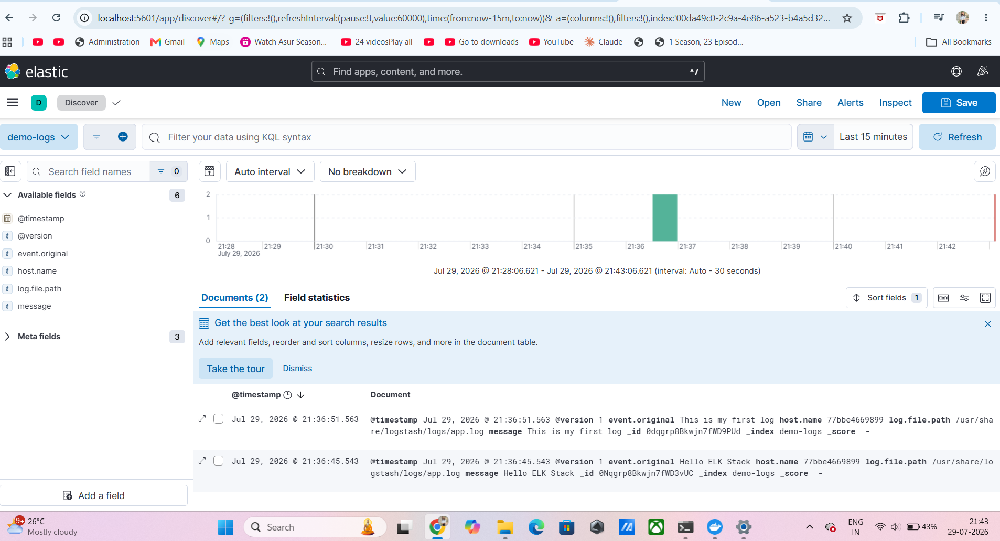

# ELK Stack Logging with Docker

A complete ELK Stack (Elasticsearch, Logstash, and Kibana) setup using Docker Compose for centralized log collection, indexing, and visualization.

## Project Overview

This project demonstrates how to:

- Run Elasticsearch, Logstash, and Kibana using Docker Compose
- Collect logs from a file using Logstash
- Store logs in Elasticsearch
- Visualize logs using Kibana Discover

## Tech Stack

- Docker
- Docker Compose
- Elasticsearch 8.13.4
- Logstash 8.13.4
- Kibana 8.13.4

## Project Structure

```
12-elk-stack-logging/
├── docker-compose.yml
├── logstash/
│   ├── config/
│   │   └── logstash.yml
│   └── pipeline/
│       └── logstash.conf
├── sample-app/
│   └── logs/
│       └── app.log
├── screenshots/
│   └── elk-discover.png
└── README.md
```

## Setup

```bash
docker compose up -d
```

Check running containers:

```bash
docker ps
```

Generate sample logs:

```bash
echo "Hello ELK Stack" >> sample-app/logs/app.log
echo "This is my first log" >> sample-app/logs/app.log
```

## Verify

Open:

```
http://localhost:5601
```

Go to:

```
Analytics → Discover
```

Create Data View:

- Name: `demo-logs`
- Index Pattern: `demo-logs*`
- Timestamp Field: `@timestamp`

## Output

Logs successfully indexed in Elasticsearch and displayed in Kibana Discover.

## Screenshot



## Learning Outcomes

- Docker Compose orchestration
- Centralized logging
- Logstash pipelines
- Elasticsearch indexing
- Kibana visualization
- ELK Stack architecture
