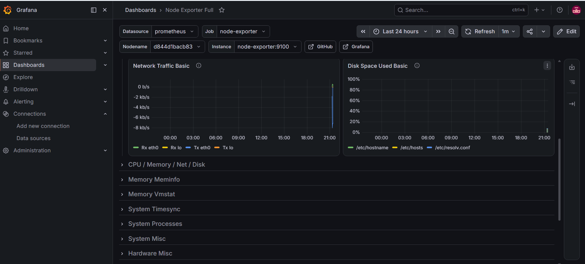
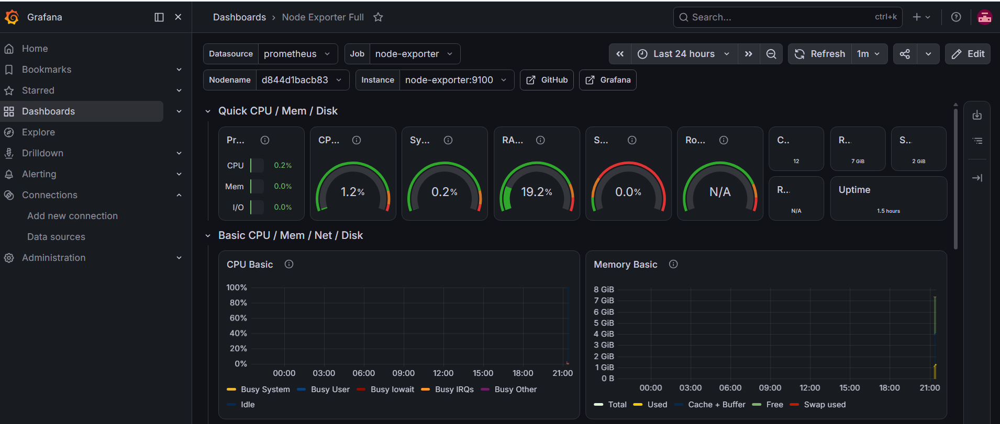
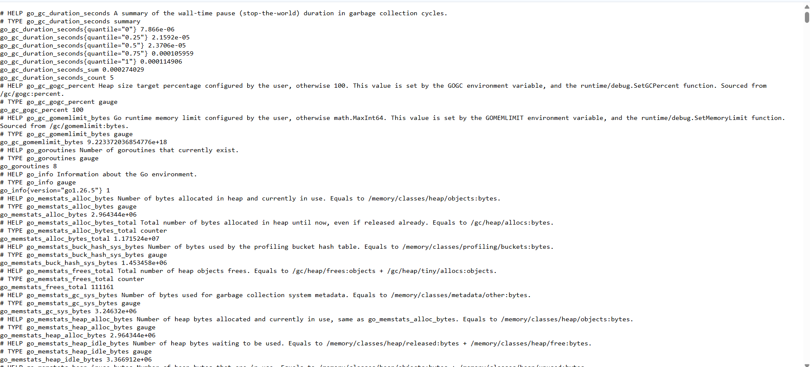
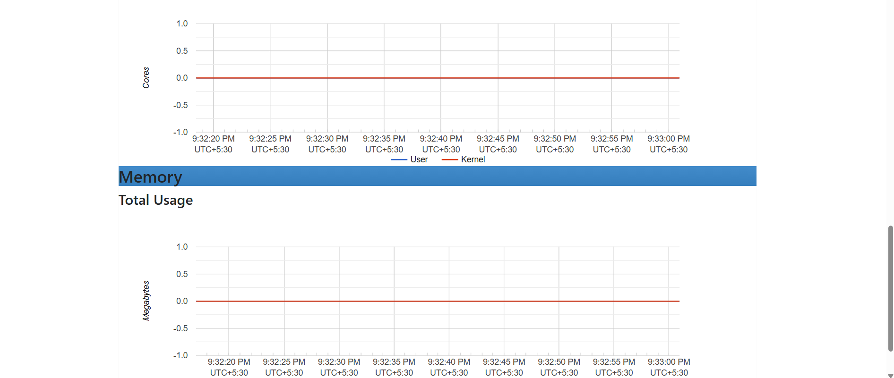
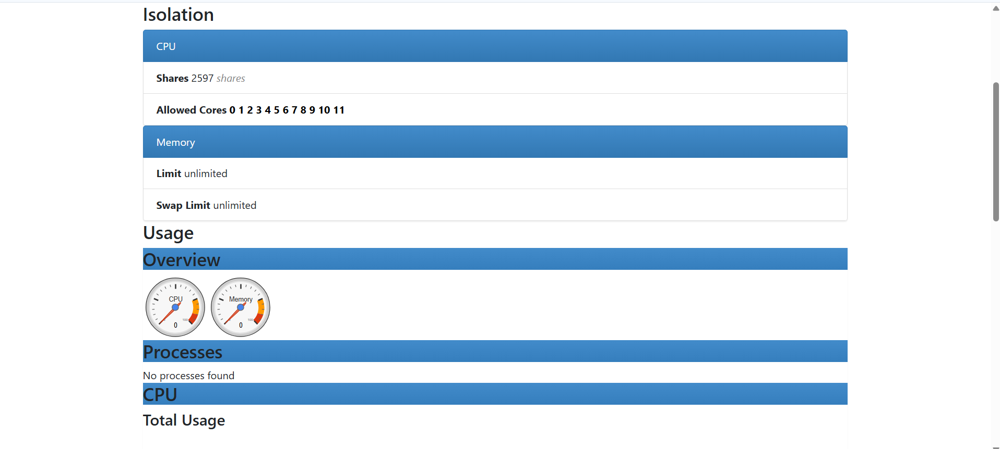
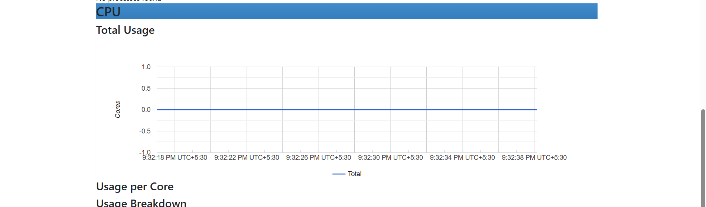

# 📊 Prometheus + Grafana Monitoring Stack with Docker

A complete monitoring solution built using Docker Compose. This project monitors the host system and Docker containers using Prometheus, Grafana, Node Exporter, and cAdvisor.

---

## 🚀 Features

- 📈 Prometheus for metrics collection
- 📊 Grafana for visualization and dashboards
- 💻 Node Exporter for host system monitoring
- 🐳 cAdvisor for Docker container monitoring
- 📝 Docker Compose based deployment
- ⚡ Real-time CPU, Memory, Disk, Network monitoring

---

## 🏗️ Architecture

```
                +------------------+
                |     Grafana      |
                |  Visualization   |
                +--------+---------+
                         |
                         |
                +--------v---------+
                |    Prometheus    |
                | Metrics Collector|
                +--------+---------+
                         |
        +----------------+----------------+
        |                                 |
+-------v--------+               +--------v--------+
| Node Exporter  |               |    cAdvisor     |
| Host Metrics   |               | Container Stats |
+----------------+               +-----------------+
```

---

## 📂 Project Structure

```
13-prometheus-grafana-monitoring/
│
├── docker-compose.yml
├── README.md
├── prometheus/
│   └── prometheus.yml
├── grafana/
└── screenshots/
    ├── grafana1.png
    ├── grafana2.png
    ├── cAdvisor.png
    ├── cAdvisor1.png
    ├── cAdvisor2.png
    └── metrics.png
```

---

## 🛠️ Tech Stack

- Docker
- Docker Compose
- Prometheus
- Grafana
- Node Exporter
- cAdvisor

---

## ⚙️ Setup

### Clone Repository

```bash
git clone https://github.com/<your-github-username>/docker-projects.git
```

### Navigate to Project

```bash
cd docker-projects/13-prometheus-grafana-monitoring
```

### Start Monitoring Stack

```bash
docker compose up -d
```

### Verify Running Containers

```bash
docker ps
```

---

## 🌐 Access Services

| Service | URL |
|----------|-----|
| Grafana | http://localhost:3000 |
| Prometheus | http://localhost:9090 |
| Node Exporter | http://localhost:9100/metrics |
| cAdvisor | http://localhost:8080 |

---

## 🔑 Grafana Login

```
Username: admin
Password: admin
```

(Change the password after first login.)

---

## 📷 Screenshots

### Grafana Dashboard



---

### Grafana Configuration



---

### Node Exporter Metrics



---

### cAdvisor Dashboard



---

### Docker Container Monitoring



---

### Container Statistics



---

## 📊 Components

### Prometheus

- Collects metrics
- Stores time-series data
- Scrapes configured targets every 15 seconds

### Grafana

- Visualizes metrics
- Creates dashboards
- Connects with Prometheus

### Node Exporter

- CPU Usage
- Memory Usage
- Disk Usage
- Network Statistics
- Filesystem Metrics

### cAdvisor

- Docker Container CPU
- Docker Container Memory
- Network Usage
- Filesystem Usage

---

## 📌 Learning Outcomes

- Docker Compose
- Monitoring Stack Deployment
- Prometheus Configuration
- Grafana Dashboard Import
- Node Exporter Integration
- Docker Container Monitoring
- Infrastructure Observability

---

## 👨‍💻 Author

Muskan Patel

GitHub: https://github.com/Mp82003
