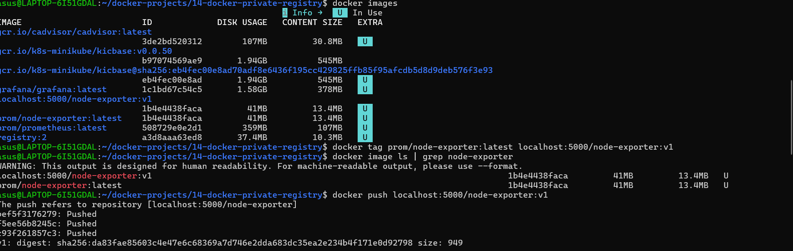
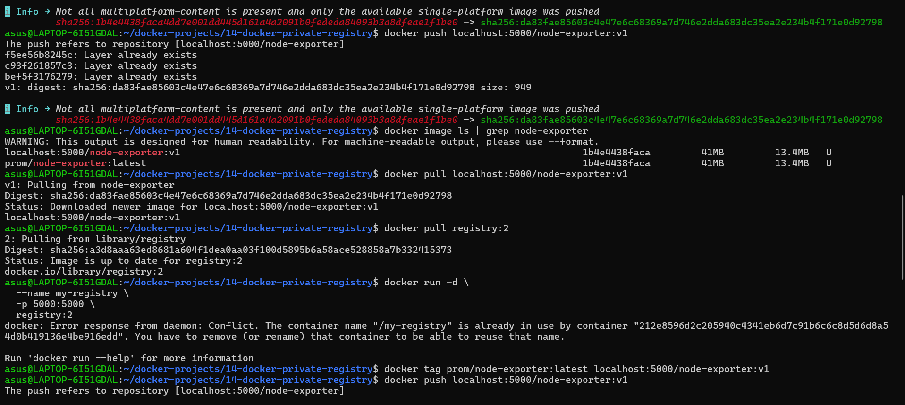
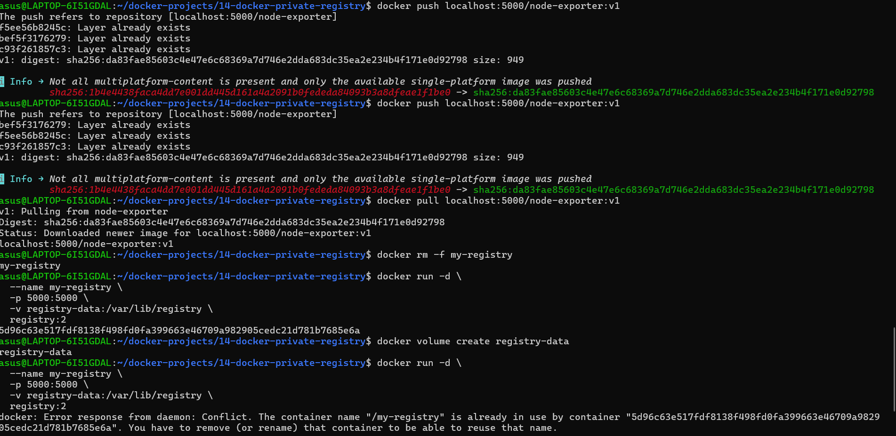

# Docker Private Registry

## 📌 Project Overview

This project demonstrates how to set up and use a **Docker Private Registry** using the official `registry:2` image. Instead of storing Docker images on Docker Hub, a local private registry is created to push and pull images securely.

---

## 🎯 Objectives

* Host a private Docker Registry
* Push Docker images to the registry
* Pull Docker images from the registry
* Understand Registry, Repository, Image, and Tag concepts

---

## 🛠️ Technologies Used

* Docker
* Docker Registry (`registry:2`)
* Ubuntu (WSL)
* Linux

---

## 📂 Project Structure

```text
14-docker-private-registry/
├── README.md
├── 1.png
├── 2.png
└── 3.png
```

---

## 🚀 Implementation Steps

### 1. Pull the Docker Registry Image

```bash
docker pull registry:2
```

### 2. Run the Private Registry

```bash
docker run -d \
  --name my-registry \
  -p 5000:5000 \
  registry:2
```

### 3. Verify the Registry

```bash
curl http://localhost:5000/v2/
```

Expected Output:

```text
{}
```

### 4. Tag an Existing Docker Image

```bash
docker tag prom/node-exporter:latest localhost:5000/node-exporter:v1
```

### 5. Push the Image to the Private Registry

```bash
docker push localhost:5000/node-exporter:v1
```

### 6. Verify Stored Repository

```bash
curl http://localhost:5000/v2/_catalog
```

Example Output:

```json
{"repositories":["node-exporter"]}
```

### 7. Pull the Image from the Private Registry

```bash
docker pull localhost:5000/node-exporter:v1
```

---

## 📸 Project Screenshots

### 1. Docker Private Registry Running



---

### 2. Registry API Verification



---

### 3. Image Push & Pull Verification



---

## 📚 Key Concepts Learned

* Docker Registry
* Private Docker Registry
* Docker Repository
* Image Tagging
* Docker Push
* Docker Pull
* Registry API
* Port Mapping
* Docker Image Management

---

## 🏆 Outcome

Successfully deployed a private Docker Registry using the official `registry:2` image, pushed a Docker image to the registry, verified the repository through the Registry API, and pulled the image back from the private registry. This project demonstrates the complete workflow of managing Docker images using a self-hosted registry.

